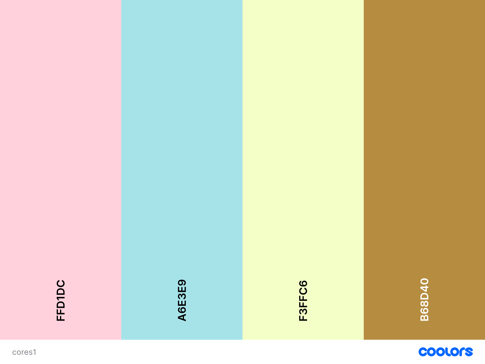
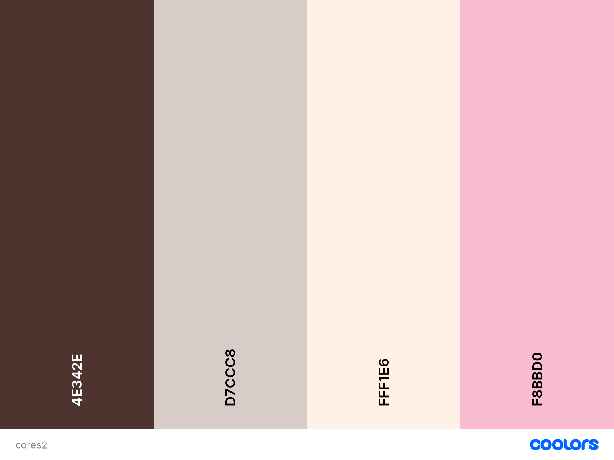
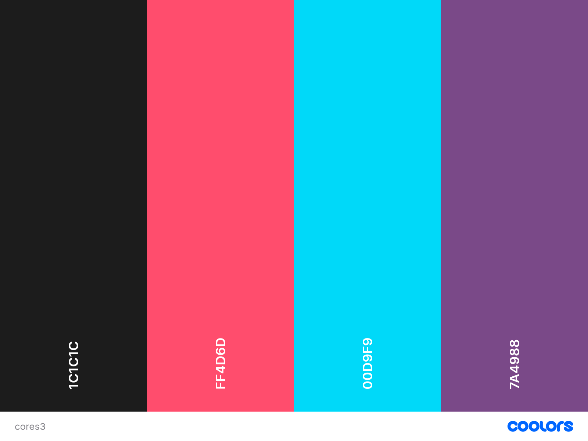
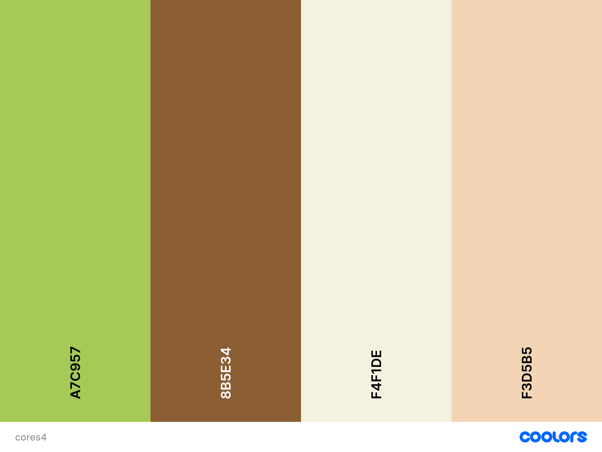

# ☕ Cafe_Pixelado
**Onde a cultura pop encontra o café perfeito!**

Projeto de site online de uma cafeteria geekdas alunas Nadine Vasconcellos Carvalho de Almeida e Sophia Agnes de Machado Ferreira.

## 💾 Aspectos visuais

### Logo
- Xícara com Corações em Pixel Art
- Controle de Videogame com Vapor de Café
- Donut Pixelado com Café no Centro
- Mascote Fofinho (Pixel Pet)

### Cores
#### Tons Pastel Retrô: delicado e acolhedor, com uma estética retrô fofa

  

    <ul>
      <li>Rosa bebê (#FFD1DC)
      <li>Azul claro (#A6E3E9)
      <li>Amarelo pastel (#3FFECB6)
      <li>Marrom suave (#B68D40)
    </ul>
  

  

    
  

#### Café Cremoso: aconchego e remete à cor do café com leite

  

    <ul>
      <li>Marrom escuro (#4E342E)
      <li>Bege (#D7CCC8)
      <li>Creme (#FFF1E6)
      <li>Rosa claro (#F8BBD0)
    </ul>
  

  

    
  

#### Geek Neon Retrô: moderno e vibrante, inspirado em fliperamas retrô

  

    <ul>
      <li>Preto (#1C1C1C)
      <li>Rosa neon (#FF4D6D)
      <li>Azul neon (#00D9F9)
      <li>Roxo escuro (#7A4988)
    </ul>
  

  

    
  

#### Natureza Geek: natural e suave que combina café com tranquilidade

  

    <ul>
      <li>Verde musgo (#A7C957)
      <li>Marrom quente (#8B5E34)
      <li>Off-white (#F4F1DE)
      <li>Amarelo pálido (#F3D5B5)
    </ul>
  

  

    
  

<!--https://colorhunt.co/palettes/coffee-->
<!--https://colorhunt.co/palettes/neon-retro-->

### Fontes:
- "Press Start 2P" (Google Fonts) - Títulos e logotipos
- "Pacifico" (Google Fonts) - Títulos e seções que remetem à delicadeza
- "Montserrat" (Google Fonts) - Texto principal para equilíbrio entre retrô e moderno.
-  "Arcade Classic" (Font Library) - Detalhes como botões ou pequenos textos

##  🧋 Aspectos textuais
### Home
- Slogan Criativo: Algo como "Onde a cultura pop encontra o café perfeito!"
- Destaques: Promoções da semana.
- Eventos especiais.
- Produtos exclusivos (canecas temáticas, jogos de tabuleiro à venda, etc.).
- Galeria Visual: Fotos do ambiente aconchegante, comidas temáticas e decoração geek.

### Sobre Nós
- História do Café: Explique a inspiração por trás do espaço.
- Missão e Valores: Criação de um espaço inclusivo para fãs de cultura geek.
- Equipe Geek: Apresente os baristas e funcionários com seus fandoms favoritos.
- Pequenos comentários de clientes geeks felizes.

### Cardápio Temático
  - Café "Espresso Patronum"
  - Milkshake "Frost of the Rings"
  - Energético "Potion de Mana"
  - "Latte da Galáxia"
  - "Café do Mago"
  - Bolos inspirados em séries/filmes
  - Destaques da casa
  - **Opções para Gamers e Veganos: Destaque inclusividade no cardápio.**
    <!-- *Programa de Fidelidade*: Com conquistas geek desbloqueáveis, como XP por compras no café. ?? -->

### Eventos e Atividades
  - Game Nights: Competições de RPG, videogames ou jogos de tabuleiro
  - Quiz Geek: Noites temáticas com prêmios.
  - Noites de jogos
  - Lançamentos de filmes
  - Ganhadores de eventos
  - Workshops: Desenho digital, criação de cosplay ou debates sobre cultura geek
  <!-- PLaylist ?? -->

<!-- >Loja Online
Produtos personalizados: canecas, camisetas e acessórios geek.
Vale-presente para os fãs da cultura pop.
6. Blog ou Notícias Geek
Postagens Regulares:
Resenhas de filmes, séries ou HQs.
Lançamentos aguardados no universo geek.-->

### Contato e Localização
  - Informações de Contato: WhatsApp, redes sociais e telefone.
- Mapa Interativo: Ajude os clientes a encontrar o café facilmente. <!-- Usar o map ? tinha pensado em usar ele em uma foto com cafés, oq acha?-->
- Horário de Funcionamento: Deixe claro o horário e dias da semana.
- Formulário de contato/reservas/eventos

<!--https://www.canva.com/design/DAGcd7ql2AA/5ufoPnvgun6HX_PJOjJvwg/edit?utm_content=DAGcd7ql2AA&utm_campaign=designshare&utm_medium=link2&utm_source=sharebutton-->