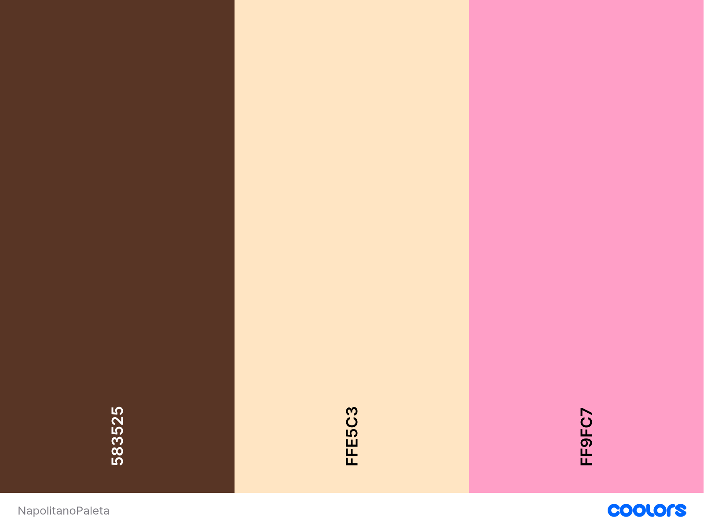

# ☕ Cafe_Pixelado
**Onde a cultura pop encontra o café perfeito!**

Projeto de site online de uma cafeteria geek das alunas Nadine Vasconcellos Carvalho de Almeida e Sophia Agnes de Machado Ferreira.

## 💾 Aspectos visuais

### Logo: Donut Pixelado com Café no Centro
  

    
  

### Cores
#### Tons Pastel Retrô: delicado e acolhedor, com uma estética retrô fofa

  

    <ul>
      <li>Marrom selo(#583525)
      <li>Trigo(#ffe5c3)
      <li>Cravo Rosa(#ff9fc7)
    </ul>
  

  

    
  

### Fontes:
- "Press Start 2P" (Google Fonts) - Títulos e logotipos
- "Montserrat" (Google Fonts) - Texto principal para equilíbrio entre retrô e moderno.

##  🧋 Aspectos textuais
### Home
- Slogan Criativo: Onde a cultura pop encontra o café perfeito!
- Eventos especiais.
- Galeria Visual: Fotos do ambiente aconchegante, comidas temáticas e decoração geek.

### Sobre Nós
- História do Café: Explique a inspiração por trás do espaço.
- Missão e Valores: Criação de um espaço inclusivo para fãs de cultura geek.
- Equipe Geek: Apresente os baristas e funcionários com seus fandoms favoritos.

### Cardápio Temático
  - Café "Espresso Patronum"
  - Milkshake "Frost of the Rings"
  - Energético "Potion de Mana"
  - "Latte da Galáxia"
  - "Café do Mago"
  - Bolos inspirados em séries/filmes
  - Destaques da casa
  - **Opções para Gamers e Veganos: Destaque inclusividade no cardápio.**
    <!-- *Programa de Fidelidade*: Com conquistas geek desbloqueáveis, como XP por compras no café. ?? -->

### Eventos e Atividades
  - Game Nights: Competições de RPG, videogames ou jogos de tabuleiro
  - Quiz Geek: Noites temáticas com prêmios.
  - Noites de jogos
  - Lançamentos de filmes
  - Ganhadores de eventos
  - Workshops: Desenho digital, criação de cosplay ou debates sobre cultura geek
  <!-- PLaylist ?? -->

<!-- >Loja Online
Produtos personalizados: canecas, camisetas e acessórios geek.
Vale-presente para os fãs da cultura pop.
6. Blog ou Notícias Geek
Postagens Regulares:
Resenhas de filmes, séries ou HQs.
Lançamentos aguardados no universo geek.-->

### Contato e Localização
  - Informações de Contato: WhatsApp, redes sociais e telefone.
  - Mapa Interativo: Ajude os clientes a encontrar o café facilmente. <!-- Usar o map ? tinha pensado em usar ele em uma foto com cafés, oq acha?-->
  - Formulário de contato/reservas/eventos

<!--https://www.canva.com/design/DAGcd7ql2AA/5ufoPnvgun6HX_PJOjJvwg/edit?utm_content=DAGcd7ql2AA&utm_campaign=designshare&utm_medium=link2&utm_source=sharebutton-->